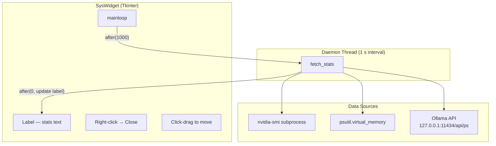
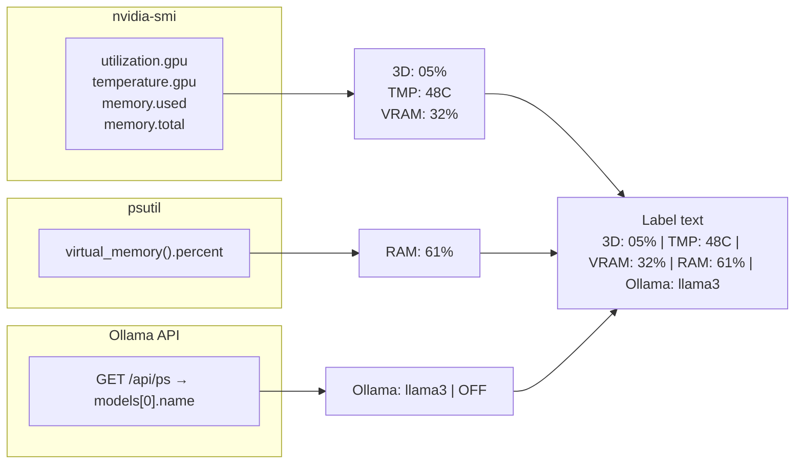
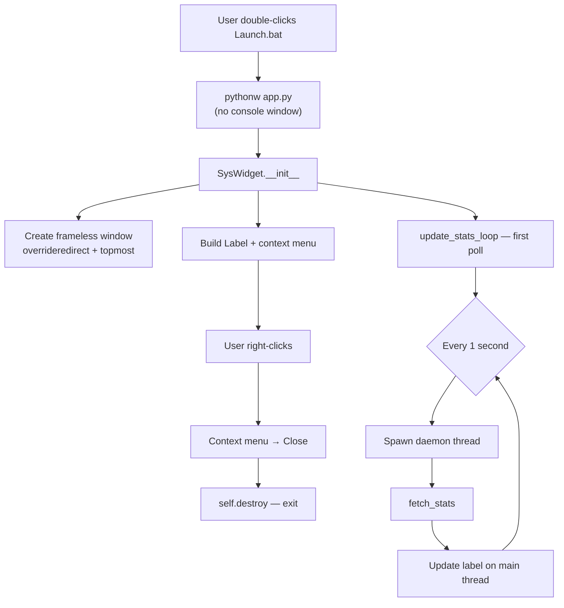
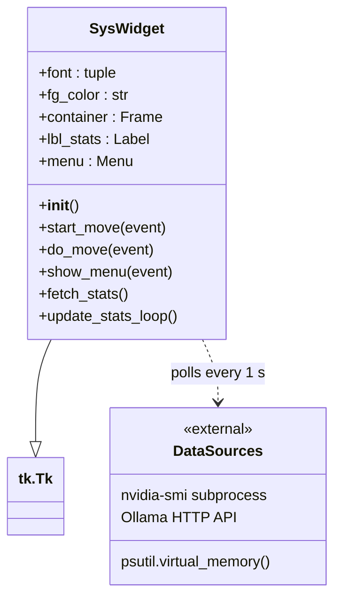

# System Stats Widget — Diagrams

## 1. Component Architecture

How the widget's major components connect: the Tkinter UI, the background
polling thread, and the three external data sources.

## 2. Data Flow

What each data source returns and how values are formatted before reaching
the display.

## 3. Launch & Lifecycle

From double-clicking the batch file to the running widget, including how the
window is closed.

## 4. SysWidget Class Map

All methods on the `SysWidget` class grouped by responsibility.

